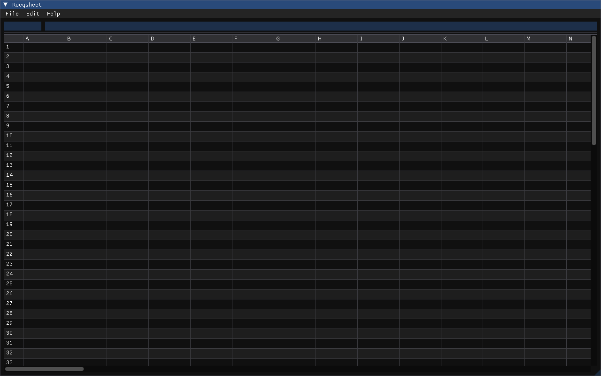

# Rocqsheet



A small spreadsheet whose evaluation kernel is written in
[Rocq](https://rocq-prover.org/) and extracted to C++ with
[Crane](https://github.com/bloomberg/crane).  A Dear ImGui front-end
consumes the extracted kernel and provides the editable grid.

## Verified properties

`theories/Rocqsheet.v` proves:

* `get_set_eq` — writing a value to a cell and reading the same
  cell back returns that value.
* `get_set_neq` — writing one cell does not disturb another with a
  different array index.
* `eval_empty`, `eval_lit` — `eval_cell` on an empty cell is `0`,
  on a literal is the literal.
* `smoke_computes` — `(2+3)*7` evaluates to `35`.
* `eval_self_cycle_diverges`, `eval_divzero` — self-cycles and
  division by zero return `None`.

The parser, the ImGui front-end, and the file I/O are plain C++.

## Build

```bash
git clone --recurse-submodules https://github.com/CharlesCNorton/rocqsheet.git
cd rocqsheet
make           # extract + configure + build
make run       # launch the GUI
make test      # parser and kernel runtime tests
```

Requirements:

* Rocq 9.0 or newer with `dune`
* Crane installed via opam (`opam pin add rocq-crane ./crane`)
* a C++23 compiler (clang 18 or newer, or recent gcc)
* GLFW 3 development headers (`libglfw3-dev` on Debian/Ubuntu)
* OpenGL development headers (`libgl-dev`)
* `cmake`, `pkg-config`

CMake's `FetchContent` pulls Dear ImGui (v1.91.5) at configure time.

## Usage

* Click a cell to select; double-click to edit.
* Type a number to set a literal; type `=A1+B2` (or `=(A1+B1)*7`,
  `=A1/0`) for a formula.
* Operators: `+ - * /` with parentheses.  Cell refs are
  `<column><1-based row>` where columns run `A..CZ`.
* `#PARSE` indicates a malformed formula.  `#ERR` indicates a
  cycle, divide-by-zero, or out-of-fuel evaluation.
* Ctrl+Z / Ctrl+Y for undo / redo (64 levels).
* Ctrl+C / Ctrl+V copies the active cell's source through the OS
  clipboard.
* Ctrl+S / Ctrl+O save and load `rocqsheet.txt` in a `col,row,source`
  line format.

## License

MIT.  See [LICENSE](LICENSE).
